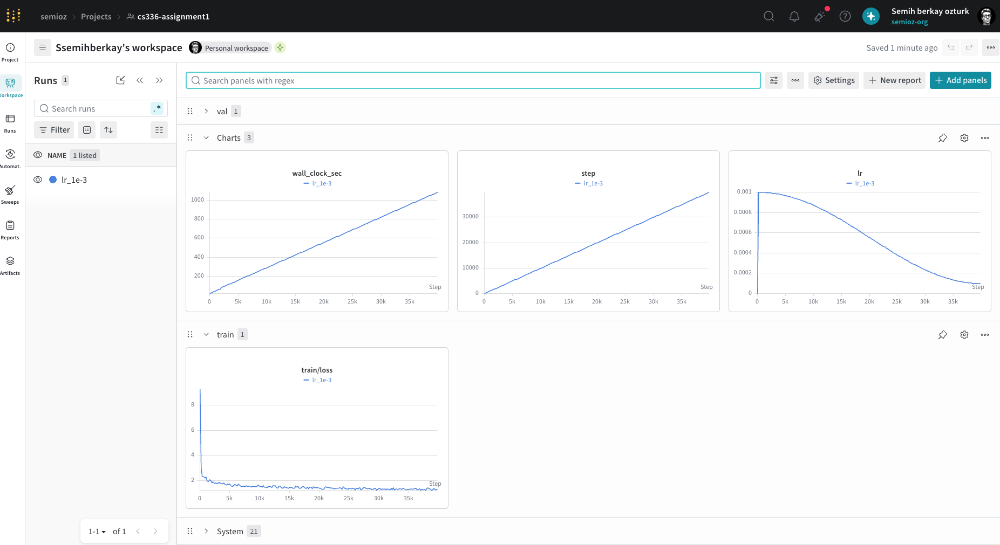

# Experiment Log

Tracking all training experiments for CS336 Assignment 1. Each experiment documents hyperparameters, setup, results, and learnings.

---

## Experiment 1: Learning Rate Sweep (7.2.3)

**Problem**: Tune the learning rate (2 B200 hrs, 3 points)
**Goal**: Find the learning rate that minimizes validation loss on TinyStories, targeting val loss ≤ 1.45.
**Budget**: 2 B200 hours total (~$7 on Modal, ~25 min/run, ~4-5 runs)

### Fixed Hyperparameters (assignment-specified)

| Parameter | Value | Notes |
|---|---|---|
| vocab_size | 10000 | BPE tokenizer trained on TinyStories |
| context_length | 256 | |
| d_model | 512 | |
| d_ff | 1344 | 8/3 · d_model rounded DOWN to multiple of 64 |
| num_layers | 4 | ~17M non-embedding params |
| num_heads | 16 | |
| rope_theta | 10000 | |
| batch_size | 32 | |
| num_steps | 40000 | 32 × 40000 × 256 = 327,680,000 tokens |
| total_tokens | 327,680,000 | Assignment target |

### Tuned Hyperparameters (starting values)

| Parameter | Value | Notes |
|---|---|---|
| max_lr | 1e-3 | Starting point, sweeping this |
| min_lr_ratio | 0.1 | Cosine decays to 10% of max_lr |
| warmup_steps | 200 | 0.5% of total steps |
| weight_decay | 0.01 | AdamW standard |
| beta1 | 0.9 | AdamW default |
| beta2 | 0.999 | AdamW default |
| eps | 1e-8 | AdamW default |
| grad_clip | 1.0 | Standard for transformers |

### Sweep Plan

With 4-5 runs budgeted, strategy is to bracket the optimal LR by finding the divergence point, then backing off ("edge of stability" investigation for part b).

| Run | max_lr | Purpose | Status |
|---|---|---|---|
| 1.1 | 1e-3 | Baseline — reasonable default | pending |
| 1.2 | 2e-3 | 2x higher — check improvement or divergence | pending |
| 1.3 | 5e-4 | 2x lower — check other direction | pending |
| 1.4 | TBD | Zoom in on best region from 1.1-1.3 | pending |
| 1.5 | TBD | Final tuned run for deliverable | pending |

Additionally, for part (b), at least one run must diverge to establish the instability boundary.

### Infrastructure

- **Hardware**: B200 GPU on Modal (~25 min/run, ~$0.30/run)
- **Data**: TinyStories tokenized with 10k BPE, saved as uint16 .npy via memmap
  - train: 541,229,258 tokens, 4.12 bytes/token
  - valid: 5,465,881 tokens, 4.12 bytes/token
- **Logging**: wandb (`cs336-assignment1` project) + local JSONL metrics (step, wall_clock_sec, loss, val_loss, lr)
- **Compilation**: `torch.compile` with inductor backend (CUDA)
- **Checkpointing**: Every 5000 steps + final

### Run 1.1: max_lr = 1e-3 (Baseline)

**Status**: completed
**Command**:
```sh
uv run python scripts/modal_train.py train --gpu B200 \
  --train-path /data/tokenized/tinystories_train_ids.npy \
  --val-path /data/tokenized/tinystories_valid_ids.npy \
  --vocab-size 10000 \
  --context-length 256 \
  --d-model 512 \
  --num-layers 4 \
  --num-heads 16 \
  --d-ff 1344 \
  --rope-theta 10000.0 \
  --batch-size 32 \
  --num-steps 40000 \
  --max-lr 1e-3 \
  --warmup-steps 200 \
  --weight-decay 0.01 \
  --min-lr-ratio 0.1 \
  --log-every 200 \
  --eval-every 2000 \
  --save-every 5000 \
  --compile \
  --wandb \
  --wandb-run-name lr_1e-3
```

**Results**:
- Final validation loss: 1.3170 at step 38,000
- Best validation loss: 1.3170 at step 38,000
- Final logged training loss: 1.3346 at step 39,800
- Initial training loss: 9.2687 at step 0 (near random baseline ln(10000) = 9.2103)
- Total wall-clock time: 1081.9 seconds ≈ 18.0 minutes
- Total tokens processed: 327,680,000
- Approximate throughput: 302,880 tokens/sec
- Checkpoint: `checkpoints/lr_1e-3/run/final.pt`
- Metrics: `checkpoints/lr_1e-3/run/metrics.jsonl`
- Wandb/screenshot: `expr1.png`



**Notes**:
- The run was stable: no NaNs, no divergence, and loss decreased smoothly throughout training.
- The cosine schedule reached the intended final LR floor of ~1e-4 (`max_lr * min_lr_ratio = 1e-3 * 0.1`).
- This run already beats the assignment TinyStories target of validation loss ≤ 1.45.
- Since `max_lr=1e-3` was stable and performant, the next sweep runs should test higher learning rates (e.g. `2e-3`, `3e-3`, then a divergent probe such as `5e-3`) to investigate the edge-of-stability hypothesis.

---

## Experiment 2: Edge of Stability Analysis (7.2.3b)

**Problem**: Investigate the folk wisdom that the best learning rate is near the “edge of stability”.
**Goal**: Find the approximate learning-rate divergence boundary, then compare it with the best stable learning rate from Experiment 1.
**Deliverable**: Learning curves for increasing learning rates, including at least one divergent run, plus analysis of convergence rates.

### Hypothesis

The best validation loss should occur at the largest learning rate that remains stable, or slightly below the first divergent learning rate. If the LR is too low, convergence is slow. If it is too high, loss becomes unstable or diverges.

### Fixed Setup

Same fixed model/data/training setup as Experiment 1:

| Parameter | Value |
|---|---|
| dataset | TinyStories |
| vocab_size | 10000 |
| context_length | 256 |
| d_model | 512 |
| d_ff | 1344 |
| num_layers | 4 |
| num_heads | 16 |
| batch_size | 32 |
| num_steps | 40000 |
| total_tokens | 327,680,000 |
| optimizer | AdamW |
| grad_clip | 1.0 |
| scheduler | warmup + cosine decay to `0.1 * max_lr` |

### Planned Runs

Start from the stable LR sweep runs in Experiment 1, then increase LR until divergence appears. A divergent run means validation/train loss sharply increases, becomes unstable, or becomes NaN/Inf.

| Run | max_lr | Purpose | Expected Outcome | Status |
|---|---:|---|---|---|
| 2.1 | 1e-3 | Baseline reference from Experiment 1 | Stable | pending |
| 2.2 | 2e-3 | Higher LR, likely faster convergence | Stable or near edge | pending |
| 2.3 | 3e-3 | Probe instability boundary | Possibly unstable | pending |
| 2.4 | 5e-3 | Force divergent run if needed | Likely divergent | pending |
| 2.5 | TBD | Best stable LR just below divergence | Final candidate | pending |

### Analysis Plan

For each run, record:

- Final validation loss
- Final training loss
- Minimum validation loss reached
- Step at which minimum validation loss occurs
- Whether the run diverged
- Wall-clock runtime
- Qualitative convergence behavior from wandb curves

Questions to answer:

1. At what learning rate does training first diverge?
2. Is the best stable LR just below the divergence boundary?
3. Do higher-but-stable LRs converge faster in early training?
4. Does the best LR also produce the best final validation loss, or only the fastest early convergence?

### Results Table

| Run | max_lr | Diverged? | Final train loss | Final val loss | Best val loss | Notes |
|---|---:|---|---:|---:|---:|---|
| 2.1 | 1e-3 | _TBD_ | _TBD_ | _TBD_ | _TBD_ | _TBD_ |
| 2.2 | 2e-3 | _TBD_ | _TBD_ | _TBD_ | _TBD_ | _TBD_ |
| 2.3 | 3e-3 | _TBD_ | _TBD_ | _TBD_ | _TBD_ | _TBD_ |
| 2.4 | 5e-3 | _TBD_ | _TBD_ | _TBD_ | _TBD_ | _TBD_ |
| 2.5 | TBD | _TBD_ | _TBD_ | _TBD_ | _TBD_ | _TBD_ |

### Commands

Template command; replace `MAX_LR` and `RUN_NAME` for each run:

```sh
uv run python scripts/modal_train.py train --gpu B200 \
  --train-path /data/tokenized/tinystories_train_ids.npy \
  --val-path /data/tokenized/tinystories_valid_ids.npy \
  --vocab-size 10000 \
  --context-length 256 \
  --d-model 512 \
  --num-layers 4 \
  --num-heads 16 \
  --d-ff 1344 \
  --rope-theta 10000.0 \
  --batch-size 32 \
  --num-steps 40000 \
  --max-lr MAX_LR \
  --warmup-steps 200 \
  --weight-decay 0.01 \
  --min-lr-ratio 0.1 \
  --log-every 200 \
  --eval-every 2000 \
  --save-every 5000 \
  --compile \
  --wandb \
  --wandb-run-name RUN_NAME
```

Example divergent probe:

```sh
uv run python scripts/modal_train.py train --gpu B200 \
  --train-path /data/tokenized/tinystories_train_ids.npy \
  --val-path /data/tokenized/tinystories_valid_ids.npy \
  --vocab-size 10000 \
  --context-length 256 \
  --d-model 512 \
  --num-layers 4 \
  --num-heads 16 \
  --d-ff 1344 \
  --batch-size 32 \
  --num-steps 40000 \
  --max-lr 5e-3 \
  --warmup-steps 200 \
  --weight-decay 0.01 \
  --min-lr-ratio 0.1 \
  --log-every 200 \
  --eval-every 2000 \
  --save-every 5000 \
  --compile \
  --wandb \
  --wandb-run-name lr_5e-3_edge_probe
```

---

## Future Experiments

_Planned:_
- _7.2.4: Batch size sweep_
- _7.2.5+: Additional ablations (TBD)_

_Completed:_
- _(none yet)_
